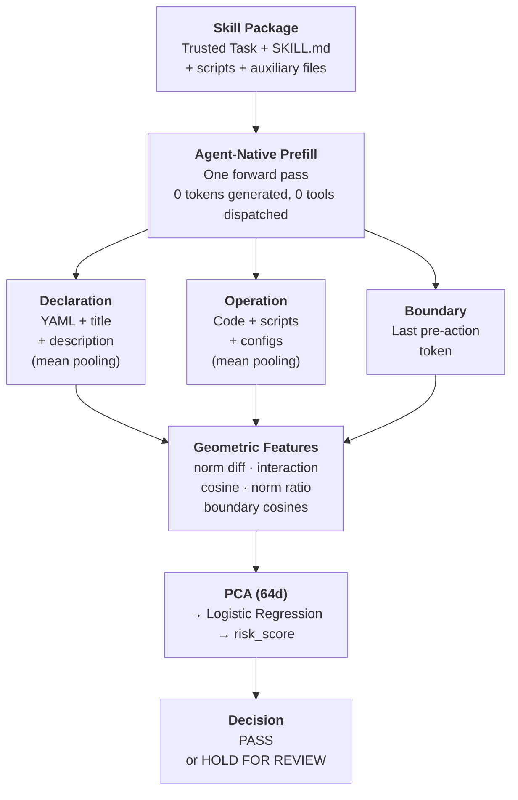

# SkillGuard

**Pre-execution hidden-state detection of malicious agent skills.**

LLM agent 读取完整 skill package 后、执行第一个动作前，从 declaration-operation hidden-state 几何关系中检测恶意 skill。

---

## 核心思路

模型读完 skill 后，**declaration（文档描述了什么）** 和 **operation（代码实际做什么）** 在 hidden space 中形成几何关系。恶意 skill 即使文本正常，这个关系也会偏离良性分布。检测这个几何偏移，而不是检测文本内容。



---

## 结果 (T3 Stealth Benchmark)

SMP Full: 242 pairs / 484 samples. Self-mutating poisoning attacks. Paired counterfactual.

| Method | FNR% ↓ | F1% ↑ | AUROC |
|---|---:|---:|---:|
| TF-IDF + LR | 6.5 | 87.9 | 0.812 |
| RouteGuard | 4.8 | 78.1 | 0.765 |
| AgentLens | 16.1 | 82.5 | 0.837 |
| **Ours** | **3.2** | **89.6** | **0.812** |

详见 [FINAL_PAPER_TABLES.md](FINAL_PAPER_TABLES.md).

---

## 代码

```
code/src/                             核心方法实现
code/experiments/                     稳定版训练与评估
data/                                 数据格式与样例
```

---

## 表格

| 文件 | 内容 |
|------|------|
| `FINAL_PAPER_TABLES.md` | T3 正式结果表 |
| `final_benchmark.xlsx` | 全量三层 benchmark 明细 |
| `related_work.xlsx` | 32 篇相关文献 |
